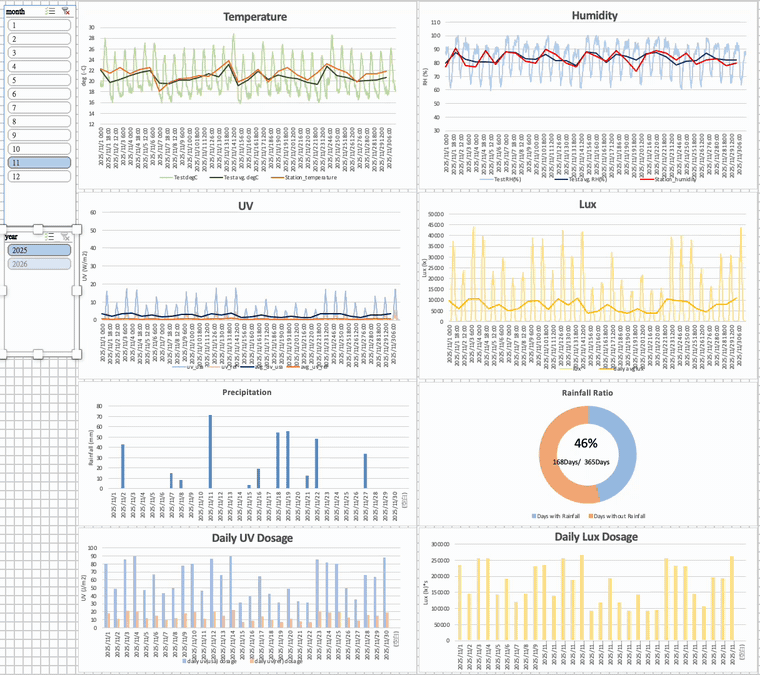
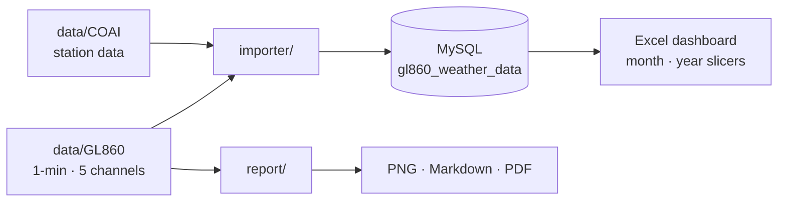
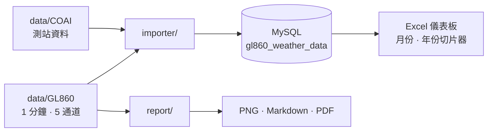

<div align="center">

# Outdoor Weathering Monitor

Data tooling for an outdoor weathering test site. It imports GL860 logger and CWA (COAI) station data into MySQL, and it turns the readings into an Excel dashboard and a PDF report.



</div>

<details open>
<summary><b>English</b></summary>

## Dashboard

[`data/weathering-dashboard-demo.xlsx`](data/weathering-dashboard-demo.xlsx) reads the imported table and draws eight linked charts: temperature, humidity, UV, lux, precipitation, rainfall ratio, and daily UV and lux dose. Pick one month, several months, or a range across the new year with the **month** and **year** slicers; every chart follows.

The demo workbook holds **synthetic data** (July 2025 to June 2026) laid out exactly like the real table: a sensor row every 30 minutes, and on each day's 00:00 row the station values and the daily statistics. The site's raw logger and station files are confidential and are not in this repository.

## What's inside

| Part | What it does |
|---|---|
| [`importer/`](importer) | Loads GL860 and COAI Excel files into MySQL. It stores one row every 30 minutes, while the daily stats and doses are computed from every 1-minute reading |
| [`report/`](report) | Builds the 8-panel chart, a Markdown summary and a PDF report from one workbook |
| [`data/`](data) | The dashboard workbook, with synthetic data. Put your own `GL860/` and `COAI/` folders here; they are git-ignored |



## Importer: 30× fewer rows, same accuracy

- A **30-minute sampled row** stores the value at that moment
- **Daily avg, min, max and range** are computed from all 1,440 readings of the day
- **Daily dose** (lux·h, W·h/m²) is integrated from the full-resolution data
- **COAI temperature, humidity and rainfall** are merged into the same table

```bash
cd importer
pip install -r requirements.txt
python deploy_all_data.py            # GL860 + COAI
python add_new_data.py               # only new months
python "update_database(rebuild).py" # clear, re-import and verify
```

The scripts create the database and tables on the first run. Set your MySQL credentials in `config.ini` and in the `password=''` defaults of the import scripts. For query examples, see [`importer/example_queries.sql`](importer/example_queries.sql).

## Report

```bash
cd report
pip install -r requirements.txt
python main.py "path/to/GL860 RAWDATA_2507.xlsx"
```

The outputs are written to the current folder. Sheet names and thresholds are set in `report/config.py`.

</details>

<details>
<summary><b>繁體中文</b></summary>

戶外耐候測試場的資料工具：把 GL860 記錄器與氣象署（COAI）測站資料匯入 MySQL，再轉成 Excel 儀表板和 PDF 報告。

## 儀表板

[`data/weathering-dashboard-demo.xlsx`](data/weathering-dashboard-demo.xlsx) 讀取匯入後的資料表，畫出 8 張連動的圖：溫度、濕度、UV、照度、降雨、降雨比例，以及每日 UV 與照度劑量。用 **month** 和 **year** 切片器可以選單一月份、多個月份，或跨年的區間，所有圖表會一起更新。

示範活頁簿裡是**合成資料**（2025 年 7 月到 2026 年 6 月），格式和真實資料表完全相同：每 30 分鐘一筆感測器資料，每天 00:00 那一筆另外帶測站數值和每日統計。測試場的原始記錄檔與測站檔屬於保密資料，不放在這個 repo。

## 內容

| 部分 | 用途 |
|---|---|
| [`importer/`](importer) | 把 GL860 和 COAI 的 Excel 匯入 MySQL。每 30 分鐘存一筆，每日統計與劑量則用全部 1 分鐘資料計算 |
| [`report/`](report) | 從一個活頁簿產生 8 格圖表、Markdown 摘要和 PDF 報告 |
| [`data/`](data) | 儀表板活頁簿（合成資料）。自己的 `GL860/`、`COAI/` 資料夾放在這裡，已被 git 忽略 |



## 匯入：資料量減少 30 倍，精度不變

- **每 30 分鐘存一筆**當下的數值
- **每日平均、最大、最小、溫差**，用當天全部 1,440 筆資料計算
- **每日劑量**（lux·h、W·h/m²），以完整解析度資料積分
- **COAI 氣溫、濕度、降雨**合併到同一張表

```bash
cd importer
pip install -r requirements.txt
python deploy_all_data.py            # GL860 + COAI
python add_new_data.py               # 只匯入新月份
python "update_database(rebuild).py" # 清空、重新匯入並驗證
```

第一次執行時，程式會自動建立資料庫和資料表。請在 `config.ini`，以及各匯入程式的 `password=''` 預設值中填入 MySQL 帳號密碼。查詢範例請見 [`importer/example_queries.sql`](importer/example_queries.sql)。

## 報告

```bash
cd report
pip install -r requirements.txt
python main.py "path/to/GL860 RAWDATA_2507.xlsx"
```

輸出檔案會寫在目前所在的資料夾。工作表名稱與閾值都在 `report/config.py` 設定。

</details>
